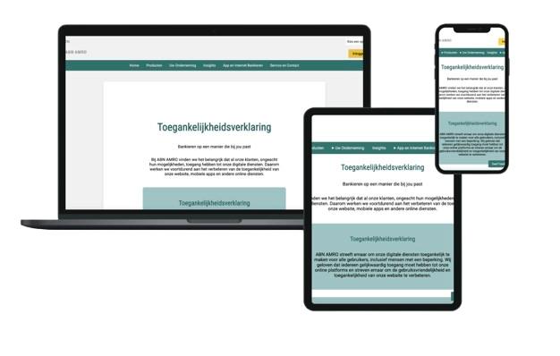
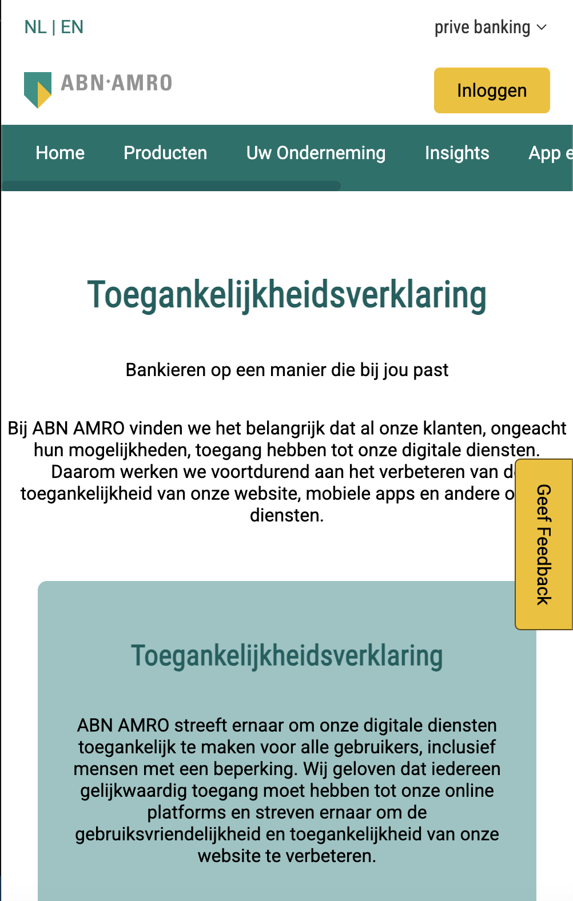
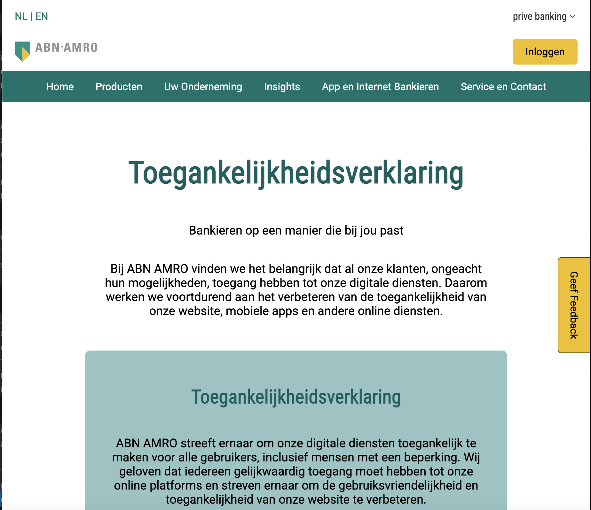
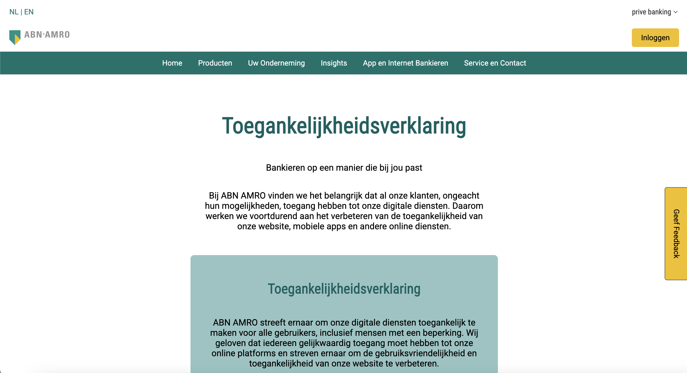

<h1>ABN AMRO Toegankelijkheid Verklaring Pagina</h1>

Dit project is een toegankelijkheidsverklaring webpagina ontworpen in de huisstijl van ABN AMRO. De webpagina is mobile-first gebouwd met twee breakpoints op min-width 800px en min-width 1000px, en bevat meerdere interactieve elementen zoals een feedbackknop en een tweede navigatiemenu met hover-effecten.

<h2>Beschrijving</h2>

De webpagina is een toegankelijkheidsverklaring waarbij gebruikers informatie kunnen vinden over de toegankelijkheid van de ABN AMRO website. Daarnaast biedt de pagina een feedbackknop waarmee gebruikers een formulier kunnen invullen om feedback te geven.

<h3>Belangrijkste functies:</h3>

Secundair menu met hover-indicatie: Als je met de muis over een menu-item gaat, verschijnt er een pijltje om duidelijk te maken welk item geselecteerd is.
Feedbackknop: Bij het klikken op de feedbackknop verschijnt er een formulier. Gebruikers kunnen dit formulier invullen en versturen of het formulier sluiten door op een kruisje te klikken.
De website is volledig responsive en ontworpen met een mobile-first aanpak. De belangrijkste interacties en ontwerpen zijn geoptimaliseerd voor gebruiksvriendelijkheid, inclusief verbeteringen gebaseerd op gebruikerstesten.

<h2>Responsive Design</h2>

De webpagina past zich aan verschillende schermgroottes aan met behulp van een mobile-first aanpak en de volgende breakpoints:

Mobiel (tot 800px): Compact ontwerp met focus op leesbaarheid en eenvoudig navigeren.
Tablet (800px - 999px): De layout wordt iets breder, en elementen worden overzichtelijker gepresenteerd.
Desktop (1000px en hoger): Volledig uitgebreide layout met extra ruimte voor inhoud.
Screenshots per breakpoint:
(Screenshots van de mobiele, tablet- en desktopversie toevoegen.)

 Mobile version 

 
 
 Tablet version

  
   
 desktop version 

   
   
<h2>Ontwerpkeuzes</h2>

<h3> Interacties </h3>

Secundair menu met hover-indicatie
Waarom: Om duidelijk te maken welk menu-item geselecteerd is, wordt er een visuele indicatie gegeven in de vorm van een pijltje dat naar voren schuift bij hover.
Feedback & feedforward: De visuele indicatie biedt feedback aan de gebruiker dat een item actief is. Het pijltje dat naar voren beweegt geeft een vorm van feedforward doordat het aangeeft dat dit menu-item aanklikbaar is.
Feedbackknop en formulier
Waarom: De feedbackknop is ontworpen zodat gebruikers eenvoudig opmerkingen kunnen insturen. Het formulier kan verzonden worden, en gebruikers kunnen het formulier sluiten door op een kruisje te klikken.
Verbeteringen uit gebruikerstests:
Feedbackknop zichtbaarheid: De knop stond onderaan en was niet direct zichtbaar. Dit is aangepast door de knop hoger te plaatsen en een opvallendere kleur binnen de huisstijl (bijvoorbeeld geel) te gebruiken.
Sterrenbeoordeling: De sterrenbeoordeling ging eerst van rechts naar links, wat verwarrend was. Dit is aangepast naar een logische volgorde van links naar rechts.
Formulier sluiten: Het sluiten van het formulier was niet duidelijk. Nu is er een meer zichtbare sluitknop toegevoegd.
Bevestiging na verzenden: Een melding verschijnt nu nadat het formulier succesvol is verzonden, zodat gebruikers weten dat hun feedback is ontvangen.

<h3>Ontwerpschetsen</h3>

<h3>Usertest</h3>

Gebruikerstesten bevindingen

<h3>Tessa:</h3>

Feedbackknop was niet direct zichtbaar → opvallendere kleur en betere plaatsing toegevoegd
Rating sterren waren onlogisch (rechts naar links) → aangepast naar links naar rechts.
Formulier sluiten was niet duidelijk → meer prominente sluitknop..

<h3>Tristan (mentor):</h3>

 Geen duidelijke bevestiging na verzenden → bevestigingsmelding toegevoegd.

<h3>Nazneen (mentor):</h3>
 

Feedbackknop was niet logisch geplaatst → knop hoger geplaatst en beter zichtbaar gemaakt.
Scenario was niet helder → scenario verduidelijkt.

<h2>Kenmerken <h2>
<h3>HTML</h3>

Semantische structuur: Gebruik van header, nav, section, en footer voor toegankelijkheid en overzichtelijkheid.
Dynamisch gegenereerde elementen zoals het feedbackformulier.

<h3>CSS</h3>

Mobile-first design: Gebruik van flexbox en media queries voor een responsieve layout.
Huisstijl van ABN AMRO toegepast: kleurenpalet, lettertypes en marges zijn consistent.

<h3>JavaScript</h3>

Interactie voor de feedbackknop: Het formulier verschijnt en verdwijnt dynamisch bij klikken.
Sterrenbeoordeling: Logica toegevoegd voor interactie met de beoordelingssterren.
Bevestigingsmelding: Feedback over het succesvol versturen van het formulier.
Codeconventies
Geoptimaliseerde en gestructureerde code met duidelijke classnamen en consistent gebruik van variabelen.

 Bekijk mijn site met de link hieronder!

<a>https://nayomekaia.github.io/the-startup-responsive-interactive-website/<a>
